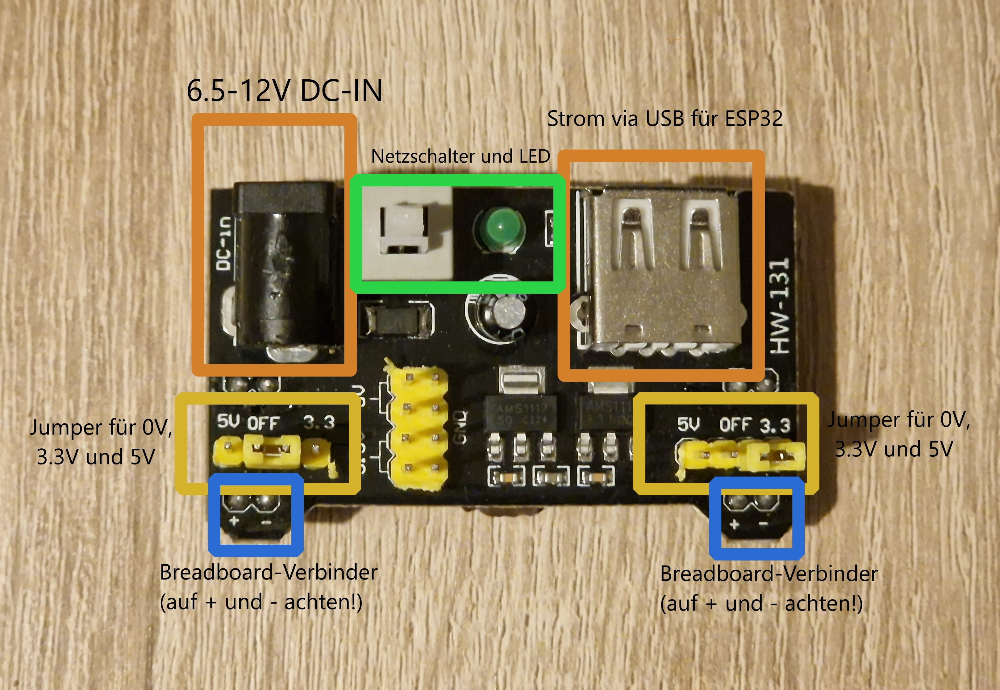

# Stromversorgung

Die Stromversorgung des Mirkocontrollers und der Sensoren kann auf mehrere Arten geschehen.
Je nachdem, welchen Anwendungszweck du gerade brauchst, lässt sich die Stromversorgung umstellen.
Wir haben dazu mehrere "Ausbaustufen" für die Stromversorgung vorbereitet.

## Zur Beachtung
Nutzt du unsere Hardware, müssen wir dich auf folgende Regeln hinweisen, um Schäden an Hardware und Teilnehmer*Innen zu vermeiden:

- **Versorge einen Sensor und/oder Mikrocontroller niemals von zwei Stromquellen gleichzeitig!**
- **Bitte betreibe den Mikrocontroller nur über seinen Micro-USB Port mit Strom.** 
- **Das MB102 Netzteil kann nur einen Mikrocontroller zuverlässig mit Strom betreiben.** Hast du zwei Mikrocontroller, dann brauchst du zwei MB102 Netzteile.
- **Vergewissere dich stets, wie und womit du gerade deine Sensoren und Mikrocontroller mit Strom versorgst.**

## MB102 Netzteil
Das MB102 Netzteil kann einen Mikrocontroller und ein paar Sensoren mit Strom versorgen (ca. 300 bis 500mA Ausgabe). Das MB102-Netzteil wird auf das Breadboard gesteckt, sodass beide Schienen mit Strom versorgt werden.

Über Jumper-Stecker kann zwischen 0V (spannungslos), 3.3V und 5V je Stromschiene unterschieden werden. Denn manche Sensoren brauchen 3.3V und manche 5V. Bitte stecke die Jumper nur im ausgeschalteten Zustand um. Das MB102 Netzteil kann über den weißen Schalter neben der grünen LED ein-und ausgeschalten werden.

Um das MB102 Netzteil mit Strom zu versorgen, stehen Batterien und Netzteile für die Steckdose bereit. Suche dir deine passende Lösung in den nachfolgenden Kapiteln aus.

## Stationär: Laptop-USB für Mikrocontroller und Sensoren
Situation:
- Mikrocontroller versorgt die Sensoren mit Strom
- Du willst den Mikrocontroller programmieren

Du brauchst:
- Micro-USB-Kabel

ToDo:
- Verbinde mit dem USB-Kabel Mikrocontroller und Laptop

## Stationär: Netzteil MB102 für Sensoren, Laptop-USB für Mikrocontroller
Situation:
- Mikrocontroller kann nicht alle Sensoren mit Strom versorgen
- Du willst den Mikrocontroller programmieren

Du brauchst:
- MB102 Netzteil
- Netzteil für die Steckdose
- USB-Kabel

ToDo:
- Verbinde mit dem USB-Kabel Mikrocontroller und Laptop
- Verbinde die Sensoren Stromversorgung mit der Breadboard-Schiene
- Verbinde das Netzteil für die Steckdose mit dem MB102 Netzteil

Achtung: Vergewissere dich stets, wie und womit du gerade deine Sensoren und Mikrocontroller mit Strom versorgst.

## Stationär: Netzteil MB102 für Mikrocontroller und Sensoren
Situation:
- Mikrocontroller kann nicht alle Sensoren mit Strom versorgen
- Der Mikrocontroller ist programmiert

Du brauchst:
- MB102 Netzteil
- Strom-Netzteil
- UBS-Kabel

ToDo:
- Verbinde mit dem USB-Kabel das MB102 Netzteil mit dem Mikrocontroller

## Mobil: Powerbank-USB für Mikrocontroller und Sensoren
Situation:
- Der Mikrocontroller ist programmiert
- Mikrocontroller versorgt die Sensoren mit Strom
- Du willst mobil Daten sammeln

Du brauchst:
- Deine 5V Powerbank, mit der du auch dein SmartPhone lädst
- USB-Kabel

ToDo:
- Verbinde mit dem USB-Kabel deine Powerbank mit dem Mikrocontroller
- Achtung: Manche Powerbanks können sich wegen der geringen Stromaufnahme des Mikrocontrollers von selbst abschalten.
- Achtung: Powerbanks nicht für den Dauerbetrieb ausgelgegt. Alternativ nutze Batterien.

## Mobil: Batterie für Mikrocontroller und Sensoren
Situation:
- Der Mikrocontroller ist programmiert
- Mikrocontroller und/oder das MB102-Netzteil versorgt die Sensoren mit Strom
- Du willst mobil Daten sammeln

Du brauchst:
- MB102-Netzteil
- USB-Kabel
- 9V-Batterie
- Batterie-Clip

ToDo:
- Verbinde mit dem USB-Kabel das MB102 Netzteil mit dem Mikrocontroller
- Vergewissere dich, dass dein MB102 Netzteil ausgeschalten ist (grüne LED ist AUS)
- Verbinde den Batterieclip mit der Batterie
- Verbinde den Batterieclip mit dem MB102

